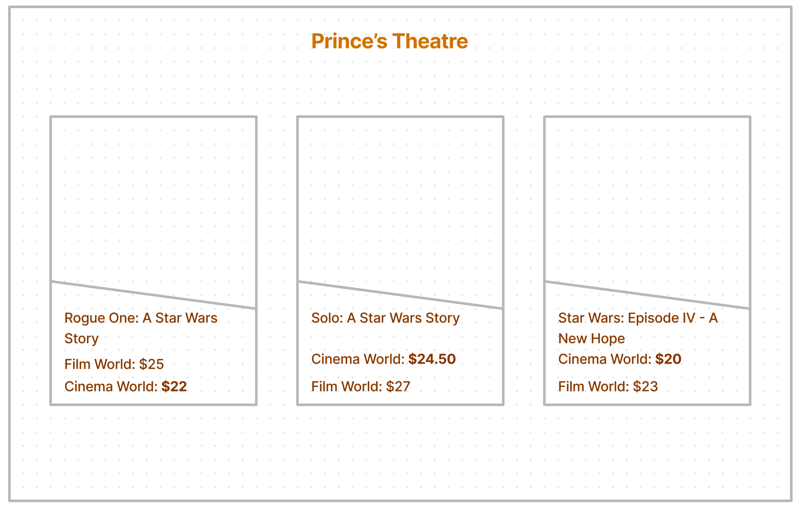
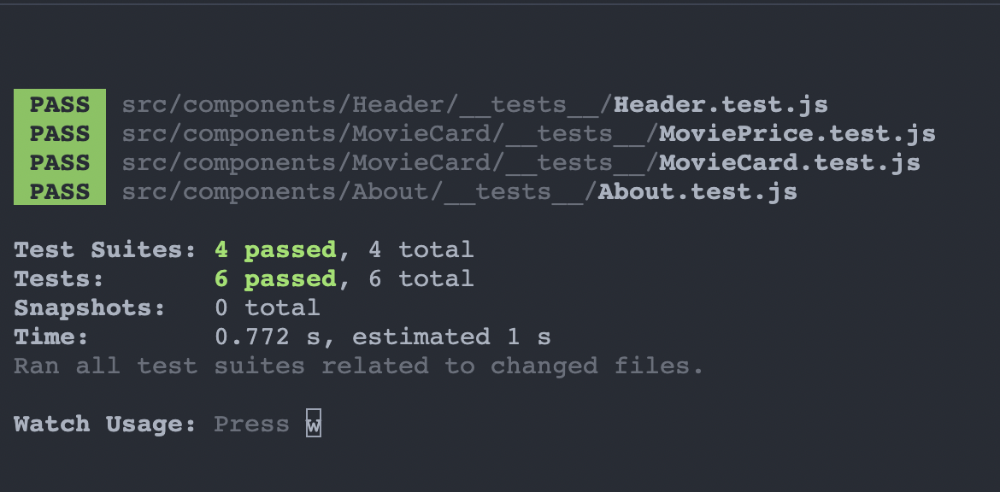

## Context: About Prince's Theatre

Prince's Theatre is a simple objective oriented application where it helps users to choose the best streaming provider for playing their favorite star wars title at the best value possible. The application is taking advantage of an API that provides a number of popular star wars titles along with their details including 2 different fees for Cinema World and Film World streaming providers. The lower price tag is indicated by a yellow background and is recommended to users. 

## Tech stack

- React  
- Sass for CSS  
- Axios for API calls

## Instruction: How to run and test

- Clone the project by `git clone https://github.com/SirvanD/Princes-Theatre.git`  

- To install dependencies run `npm install`

- To run the application run `npm start`

- To test the application run `npm run test`

## Architecture and wireframe

Prince's Theatre is an only front-end app that is making use of react Axios library for making API calls to a given endpoint where data is fetched. The main application is broken down into components of sections including Header, About, Movie Card, and Movie List, while Movie Card is itself splitted into 2 parts of main and Movie Price for ease of testing and increasing readability. 

Furthermore, a simple wireframe has initially been designed for more understanding of concept and to visualise the problem. 

## Testing and test cases

Following Unit tests have been conducted using Integrated React Testing Library:
- Component Header has been Tested with it's textcontent for protection against manipulation.
- Component About has been rendered with it's two child components of subtitle and content.
- Component Movie Card is more extensively tested with mock props, to ensure movie title and poster are correctly rendered. 
- Component Movie Price given mock inputs is tested to ensure less expensive fare is highlighted and the other one is not. 

## Assumptions and decision trade-offs
